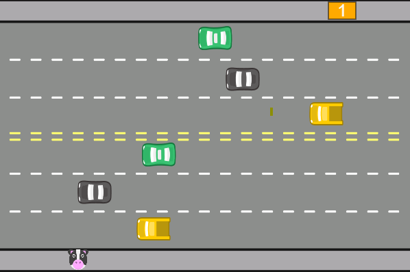

  
  
  

    

# Freeway - A Retro-Inspired JavaScript Game

Welcome to my first JavaScript project, a nostalgic journey back to 1981 with a modern twist! Inspired by the classic Atari game "Freeway," this project brings the excitement of dodging traffic to your browser.

## Project Overview

This game, developed using JavaScript and the p5.js library, captures the essence of the original Freeway game where the player guides a character across a busy highway, avoiding oncoming traffic to reach the other side safely. My aim was to recreate this retro arcade experience while enhancing it with modern coding techniques and a few unique touches.

## Features

- **Classic Gameplay:** The core mechanics stay true to the original Freeway game, challenging players to navigate through lanes of fast-moving vehicles.
- **Responsive Controls:** Smooth and intuitive controls to move the character up and down the screen, making it easy for players of all ages to jump in and play.
- **Engaging Graphics:** Bright and colorful graphics that pay homage to the retro aesthetic of Atari games while leveraging the capabilities of modern browsers.
- **Dynamic Difficulty:** As the game progresses, the speed and frequency of the traffic increase, providing a continuously escalating challenge.

## Technical Details

- **Language:** JavaScript
- **Library:** p5.js, a JavaScript library that makes coding visual and interactive elements easy.
- **Development Tools:** Developed and tested using the p5.js Web Editor, ensuring a seamless coding and debugging experience.

## Learning Experience

Creating this project was an incredible learning journey. It taught me the fundamentals of JavaScript, from basic syntax to more advanced concepts like event handling and animation. I also gained valuable experience in using p5.js to create interactive and visually appealing web content.

## Try It Out

Experience the fun and challenge of Freeway by playing the game here: [Play Freeway](https://editor.p5js.org/weslleyOlli/sketches/2nTCcNyuT)

I'm excited to continue developing my skills and creating more interactive projects in the future. Stay tuned for more updates and new games!
